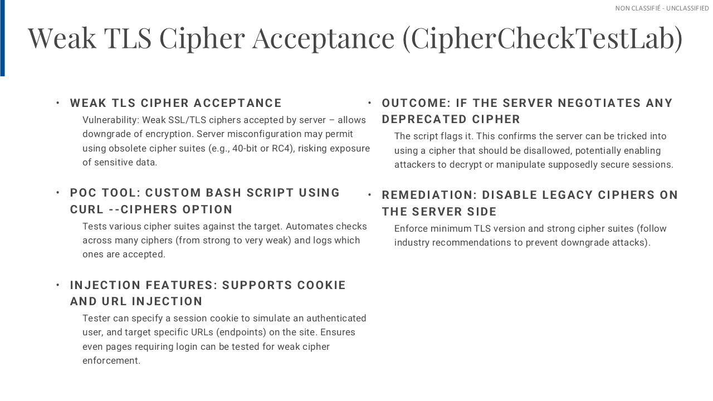
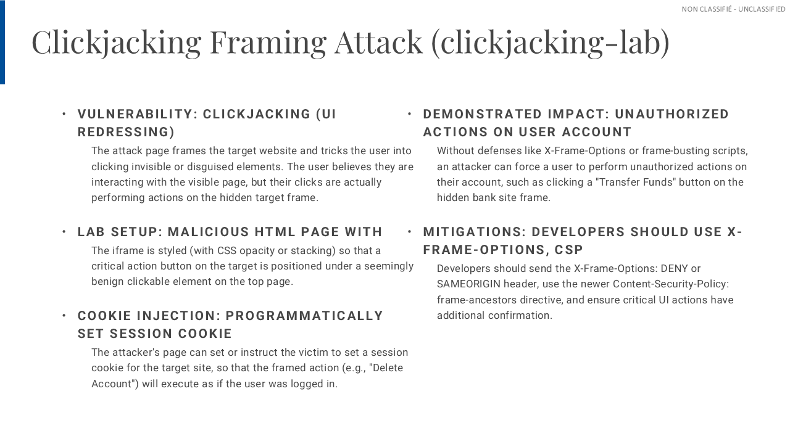
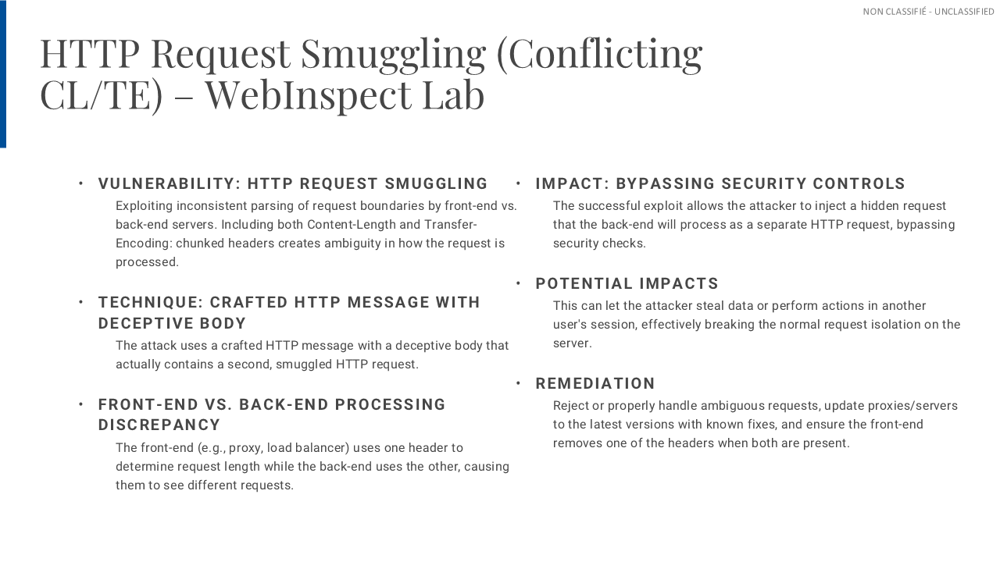
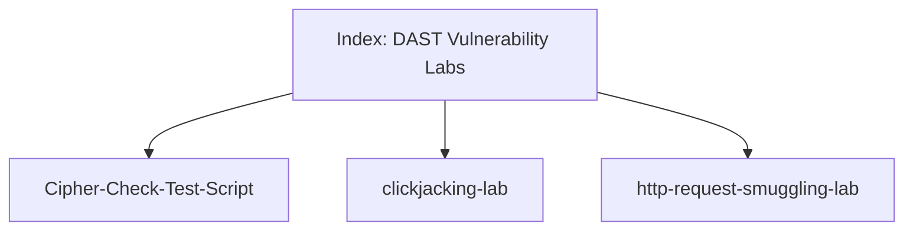

# DAST Vulnerability Labs — Index

## Overview & Motivation

This repository is an **index and navigation point** for three proof-of-concept (PoC) labs demonstrating web application vulnerabilities identified through **Dynamic Application Security Testing (DAST)**.  
By centralizing links and context, we avoid duplicating code while keeping a clean, consistent entry point for reviewers, developers, and security testers.

Each lab focuses on a specific area—**weak TLS ciphers**, **clickjacking**, and **HTTP request smuggling**—with runnable PoCs and clear remediation notes.

---

## Lab Projects

### 1) Cipher-Check-Test-Script — Weak TLS Cipher Suite Acceptance
Tests if a server negotiates **weak/deprecated TLS ciphers** by iterating a list via `curl --ciphers`.  
Supports cookie and URL options to reach authenticated endpoints.  
**Remediation:** disable obsolete ciphers and enforce minimal TLS versions.

**Repo:** https://github.com/dbaimakov/Cipher-Check-Test-Script

---

### 2) clickjacking-lab — Clickjacking Framing Attack
A minimal HTML PoC that uses an `<iframe>` and overlay to demonstrate **UI redress** (clickjacking).  
Shows how a user click on a visible control can trigger a hidden action in the framed page.  
**Mitigation:** `X-Frame-Options` (`DENY`/`SAMEORIGIN`) or CSP `frame-ancestors`.

**Repo:** https://github.com/dbaimakov/clickjacking-lab

---

### 3) http-request-smuggling-lab — Conflicting CL/TE Headers
Demonstrates **HTTP Request Smuggling** when front-end and back-end parse request boundaries differently (e.g., `Content-Length` vs `Transfer-Encoding: chunked`).  
Includes raw PoC requests and reproduction steps.  
**Mitigation:** normalize/strip conflicting headers, prefer HTTP/2 end-to-end, update/properly configure proxies & back-ends.

**Repo:** https://github.com/dbaimakov/http-request-smuggling-lab

## Diagram: Index ↔ Lab Repositories

